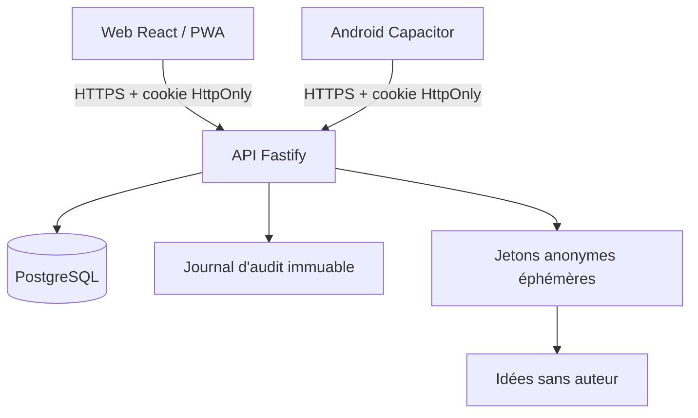

# Architecture

Chaque table métier porte `etablissement_id`. L’API ajoute ce filtre à chaque lecture ou mutation. Les autorisations sont évaluées côté serveur; l’interface n’est jamais considérée comme une barrière de sécurité.

Le Web et Android partagent le même code React. Capacitor produit le projet Android natif et permet la signature dans Android Studio. Cette décision réduit la maintenance et respecte la demande d’une base mutualisée.

## Flux d’idée anonyme

1. L’utilisateur authentifié obtient un jeton aléatoire valable dix minutes.
2. La base ne reçoit que le hash du jeton et l’établissement, sans identifiant utilisateur.
3. Le dépôt se fait sur une route séparée; le jeton est supprimé dans la transaction qui crée l’idée.
4. L’idée ne contient ni auteur, ni IP, ni appareil. Un code de suivi n’est conservé que sous forme de hash.
5. La journalisation HTTP par requête est désactivée pour empêcher une corrélation accidentelle. Le proxy d’hébergement doit aussi exclure les chemins `/ideas` de ses journaux d’accès.

## Extension temps réel

Pour le pilote, l’interface recharge une discussion après envoi. La production peut ajouter WebSocket avec authentification de la session et abonnement uniquement après vérification d’appartenance à l’espace. Ne jamais transmettre un événement avant ce contrôle.
